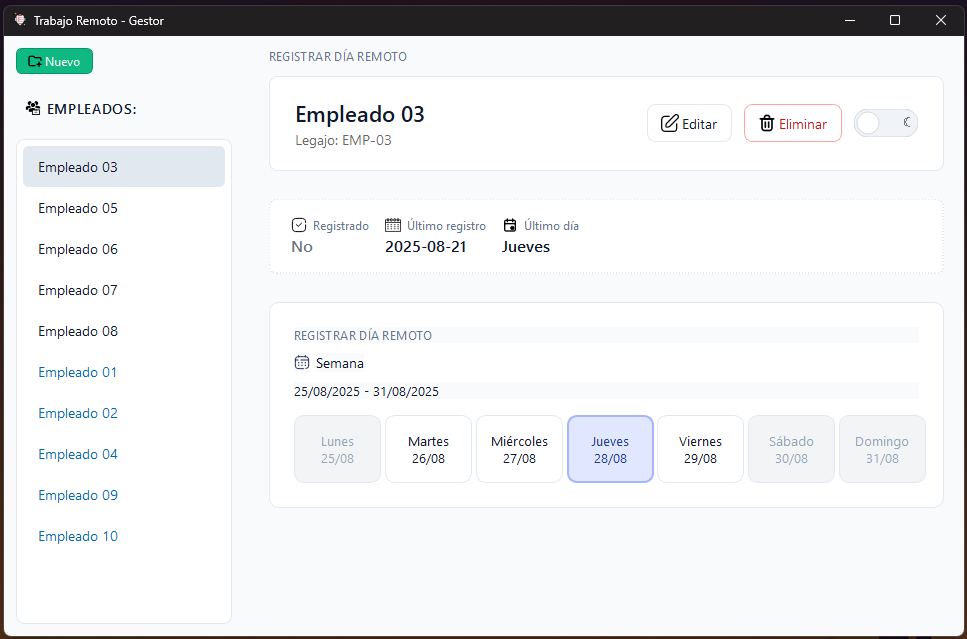
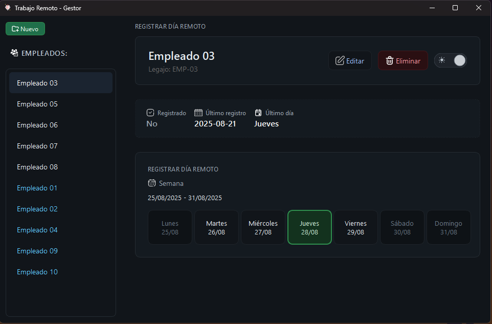
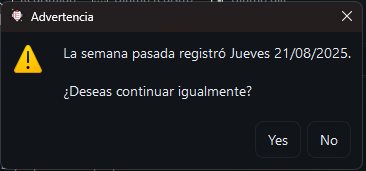
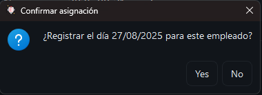
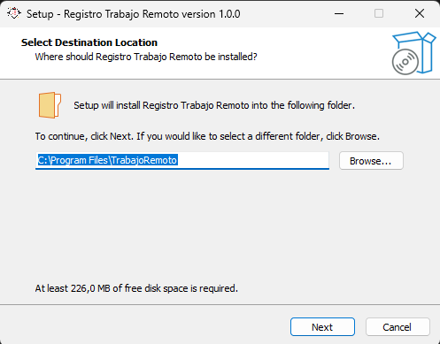
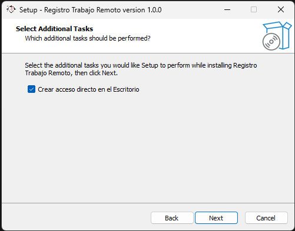
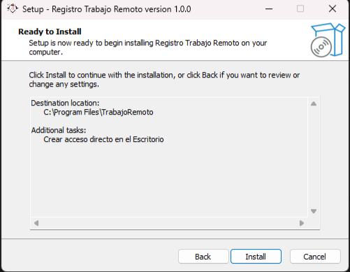
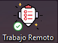

### Trabajo Remoto — Gestor (Windows)

Aplicación de escritorio hecha en Python + PyQt6 para que un supervisor asigne, por empleado, un único día remoto por semana. Incluye reglas de negocio, interfaz moderna con temas claro/oscuro, empaquetado con PyInstaller y un instalador de Windows (Inno Setup).

### Características clave
- **Una asignación por semana** por empleado (con control de duplicados).
- **Días no permitidos**: Lunes, Sábado y Domingo.
- **Advertencia inteligente** si intenta repetir el mismo día que la semana anterior, con opción de continuar.
- **Calendario semanal** con botones por día; se marca automáticamente el día registrado del empleado seleccionado.
- **Lista de empleados** con indicador visual de “registrado esta semana”.
- **Temas** claro/oscuro conmutables desde un switch (iconografía adaptativa).
- **Persistencia local** en SQLite (DB y logs en `%LOCALAPPDATA%/TrabajoRemoto`).

### Requisitos
- Windows 10/11.
- Python 3.11+ únicamente para desarrollo. Los usuarios finales instalan desde `.exe`/Setup.

### Estructura del proyecto
- `ui/` interfaz PyQt6, `main_window.py`, QSS de temas e iconos SVG.
- `services/` reglas de negocio (`AssignmentService`).
- `data/` SQLite: conexión (`db_utils`), esquema (`schema`) y repositorios (`user_repo`, `assignament_repo`).
- `models/` modelos de dominio (`User`, `Record`).
- `scripts/` build con PyInstaller, script de Inno Setup.

### Ejecutar en desarrollo
```powershell
python -m venv .venv
. .\.venv\Scripts\Activate.ps1
pip install -r requirements.txt
python main.py
```

Notas:
- La app crea/valida las tablas al iniciar (primer frame) y centra la ventana.
- Los recursos (QSS e iconos) se cargan desde `ui/resources` en desarrollo o desde el bundle en producción.

### Empaquetado (.exe) con PyInstaller
Usa salida `--onedir` para mejor tiempo de inicio.
```powershell
pwsh -NoProfile -File scripts\build.ps1
```
Salida: `dist/TrabajoRemoto/TrabajoRemoto.exe`.

Opcional: firma de código si defines variables de entorno antes del build:
```powershell
$env:SIGN_PFX_PATH="C:\ruta\certificado.pfx"
$env:SIGN_PFX_PASS="<password>"
$env:SIGN_TIMESTAMP_URL="http://timestamp.digicert.com"  # opcional
pwsh -NoProfile -File scripts\build.ps1
```

### Instalador de Windows (Inno Setup)
Compila el script con Inno Setup Compiler (ISCC):
```powershell
& "C:\Program Files (x86)\Inno Setup 6\ISCC.exe" "scripts\TrabajoRemoto.iss"
```
Genera: `dist/TrabajoRemoto-Setup.exe`.

Características del instalador:
- Instala en `C:\Program Files\TrabajoRemoto` (requiere admin).
- Crea accesos directos (menú inicio y escritorio).
- Opción de firma del Setup si defines `SIGN_PFX_PATH`/`SIGN_PFX_PASS` en el entorno (manejado en el `.iss`).

SmartScreen: sin un certificado de firma de código reconocido, Windows puede mostrar aviso. Usa “Más información” → “Ejecutar de todas formas”.

### Arquitectura y decisiones
- **Capa UI (PyQt6)**: vista reactiva con `QListWidget` + botones de semana. El switch de tema es un `QWidget` custom dibujado con `QPainter` y adaptado a DPI.
- **Servicios**: `AssignmentService` concentra reglas (perímetro de semana, validaciones, repetición de día, cambios de registro) y orquesta repos.
- **Repositorios**: SQL simple con `sqlite3`, `PRAGMA foreign_keys = ON` y manejo de errores con excepciones de dominio.
- **Logging**: `TimedRotatingFileHandler`, captura de excepciones globales y nivel automático por entorno.
- **Rendimiento**: carga diferida de datos (`QTimer.singleShot(0)`), `setUniformItemSizes(True)` en la lista, y `--onedir` para mejorar startup.

### Uso básico
1) Agrega empleados con “Nuevo”.
2) Selecciona un empleado y elige un día permitido (Mar–Vie).
3) Si coincide con el día de la semana anterior, verás una advertencia con opción de continuar.
4) Puedes cambiar el día de la semana actual; la UI refleja el cambio y marca el botón correspondiente.

### Ubicación de datos y logs
- Base de datos: `%LOCALAPPDATA%/TrabajoRemoto/trabajo_remoto.db`.
- Logs diarios: `%LOCALAPPDATA%/TrabajoRemoto/logs/app.log` (rotación automática).

### Troubleshooting
- “No se ve el icono”: coloca `ui/resources/app.ico` o `app.png` antes del build.
- SmartScreen: sin firma, es normal el aviso. Con firma (.pfx) se reduce.
- Error de imports al ejecutar scripts fuera de raíz: ejecuta desde la raíz del proyecto o usa el `.exe`/Setup.

### Capturas de pantalla

<div align="center">
  
</div>

<div align="center">
  
</div>

<div align="center">
  
  
</div>

<div align="center">
  
  
  
</div>

<div align="center">
  
  
</div>

### Licencia
MIT